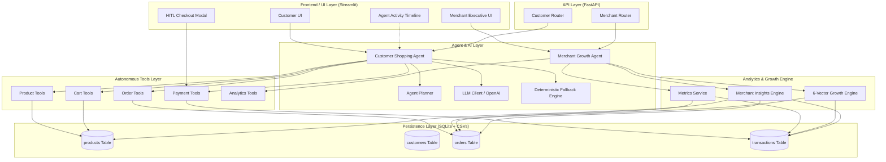
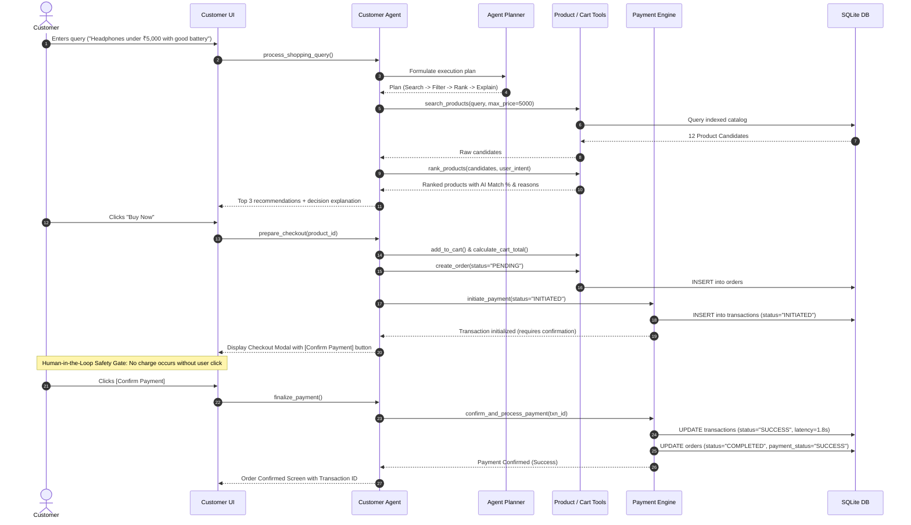
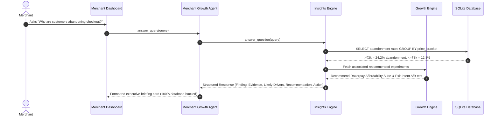
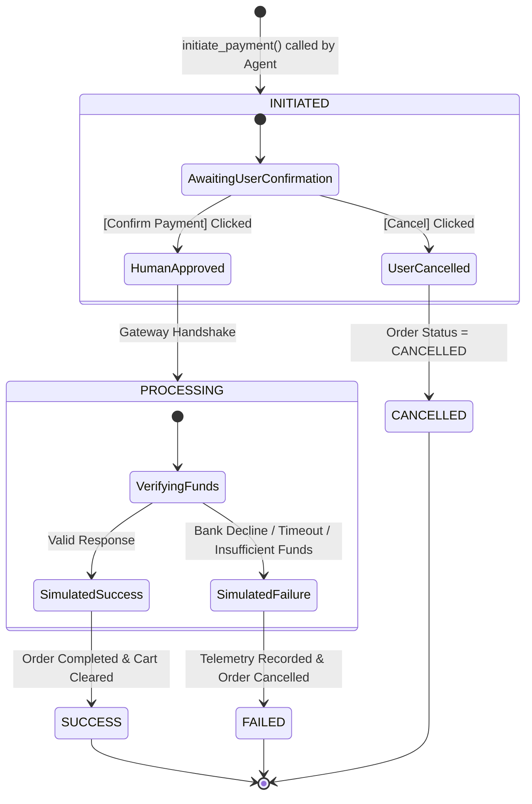

# PayPilot Agent — System Architecture & Data Flow

This document details the software architecture, component relationships, agent planner flow, and transaction state machine of the **PayPilot Agent** platform.

---

## 1. High-Level System Architecture

---

## 2. Customer Agentic Workflow & HITL Sequence

---

## 3. Merchant Telemetry & Zero-Hallucination Query Flow

---

## 4. Payment Finite State Machine (FSM)

