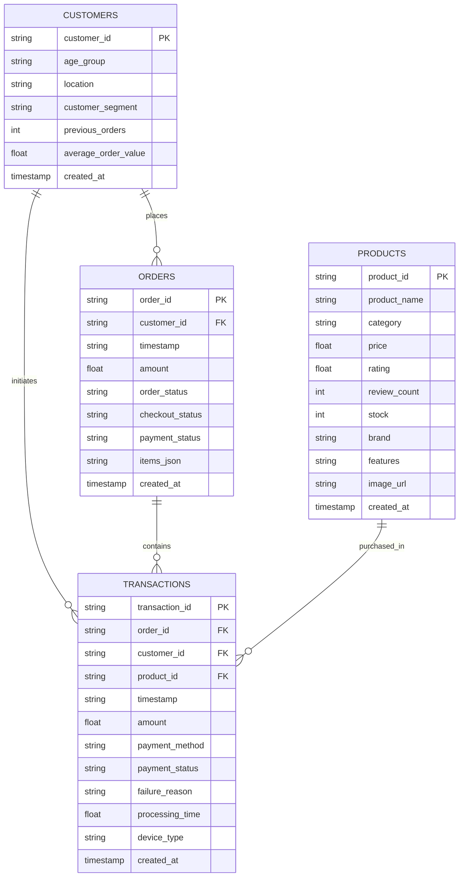

# PayPilot Agent — Data Model & Telemetry Specification

This document describes the relational database schema, indexes, synthetic data distributions, and entities used across the PayPilot Agent platform.

---

## 1. Relational Entity Relationship Diagram

---

## 2. Table Schemas & Indexing

### `products` Table
| Column | Type | Constraints | Description |
| :--- | :--- | :--- | :--- |
| `product_id` | TEXT | PRIMARY KEY | Unique identifier (e.g. `PROD-AUD-001`) |
| `product_name` | TEXT | NOT NULL | Display name |
| `category` | TEXT | NOT NULL | Category (Headphones, Laptops, Smartphones, etc.) |
| `price` | REAL | NOT NULL | Price in INR (₹) |
| `rating` | REAL | NOT NULL | Rating (1.0 - 5.0) |
| `review_count` | INTEGER | NOT NULL | Total verified reviews |
| `stock` | INTEGER | NOT NULL | Active inventory count |
| `brand` | TEXT | NOT NULL | Brand name |
| `features` | TEXT | NOT NULL | JSON string of bullet specifications |
| `image_url` | TEXT | NULLABLE | Direct image URL |

*Indexes: `idx_products_category`, `idx_products_price`, `idx_products_rating`*

---

### `customers` Table
| Column | Type | Constraints | Description |
| :--- | :--- | :--- | :--- |
| `customer_id` | TEXT | PRIMARY KEY | Unique identifier (e.g. `CUST-0042`) |
| `age_group` | TEXT | NOT NULL | Demographic bracket (18-24, 25-34, 35-44, etc.) |
| `location` | TEXT | NOT NULL | City (Bengaluru, Mumbai, Delhi NCR, etc.) |
| `customer_segment` | TEXT | NOT NULL | High Value, Budget Conscious, Tech Enthusiast |
| `previous_orders` | INTEGER | DEFAULT 0 | Historical order count |
| `average_order_value` | REAL | DEFAULT 0.0 | Historical AOV |

*Indexes: `idx_customers_segment`, `idx_customers_location`*

---

### `orders` Table
| Column | Type | Constraints | Description |
| :--- | :--- | :--- | :--- |
| `order_id` | TEXT | PRIMARY KEY | Unique identifier (e.g. `ORD-00123`) |
| `customer_id` | TEXT | FOREIGN KEY | References `customers(customer_id)` |
| `timestamp` | TEXT | NOT NULL | ISO date-time string |
| `amount` | REAL | NOT NULL | Total order amount |
| `order_status` | TEXT | NOT NULL | `PENDING`, `COMPLETED`, `CANCELLED`, `ABANDONED` |
| `checkout_status` | TEXT | NOT NULL | `INITIATED`, `COMPLETED`, `ABANDONED` |
| `payment_status` | TEXT | NOT NULL | `PENDING`, `SUCCESS`, `FAILED`, `REFUNDED` |
| `items_json` | TEXT | NULLABLE | JSON array of cart items |

*Indexes: `idx_orders_customer`, `idx_orders_status`, `idx_orders_checkout_status`, `idx_orders_timestamp`*

---

### `transactions` Table
| Column | Type | Constraints | Description |
| :--- | :--- | :--- | :--- |
| `transaction_id` | TEXT | PRIMARY KEY | Unique identifier (e.g. `TXN-000456`) |
| `order_id` | TEXT | FOREIGN KEY | References `orders(order_id)` |
| `customer_id` | TEXT | FOREIGN KEY | References `customers(customer_id)` |
| `product_id` | TEXT | NULLABLE | Associated primary product ID |
| `timestamp` | TEXT | NOT NULL | ISO date-time string |
| `amount` | REAL | NOT NULL | Transaction value in INR |
| `payment_method` | TEXT | NOT NULL | `UPI`, `Card`, `Net Banking`, `Wallet` |
| `payment_status` | TEXT | NOT NULL | `INITIATED`, `PROCESSING`, `SUCCESS`, `FAILED` |
| `failure_reason` | TEXT | NULLABLE | `TIMEOUT`, `BANK_DECLINED`, `INSUFFICIENT_FUNDS`, `NONE` |
| `processing_time` | REAL | NOT NULL | Latency in seconds (1.0s - 14.5s) |
| `device_type` | TEXT | NOT NULL | `Mobile` (68%), `Desktop` (24%), `Tablet` (8%) |

*Indexes: `idx_tx_order`, `idx_tx_status`, `idx_tx_method`, `idx_tx_failure`, `idx_tx_timestamp`*

---

## 3. Synthetic Telemetry Distributions & Intentional Patterns

The synthetic dataset is generated deterministically (`random.seed(42)`) to ensure that reviewer questions consistently surface rich diagnostic signals:

1. **High-Value Checkout Abandonment Pattern**:
   - Orders > ₹3,000 exhibit a **~24% abandonment rate**.
   - Orders <= ₹3,000 exhibit a **~13% abandonment rate**.
2. **Payment Method Performance Breakdown**:
   - **UPI**: 55% share, **92% success rate**, ~2.5s avg processing time.
   - **Wallet**: 8% share, **89% success rate**, ~2.2s avg processing time.
   - **Card**: 25% share, **83% success rate**, ~4.8s avg processing time.
   - **Net Banking**: 12% share, **74% success rate**, ~8.9s avg processing time (frequent `TIMEOUT` & bank declines).
3. **Temporal Scope**: 1,500 historical orders distributed evenly across a 90-day baseline window.
